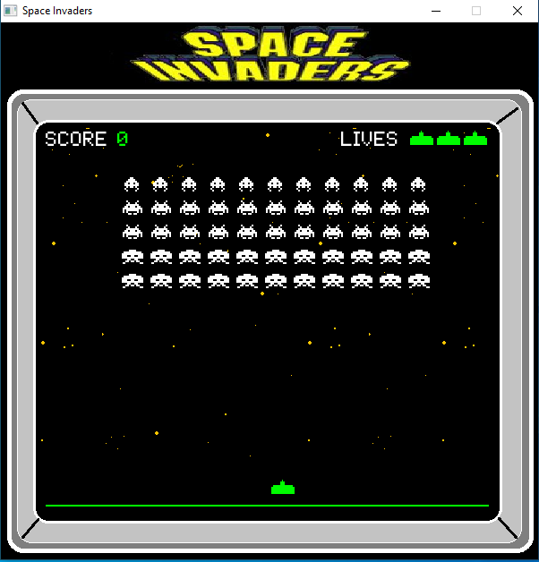

# Space Invaders

<p align="center">
  
</p>

<p align="center"><em>El clasico de las maquinitas, rehecho en C.</em></p>

---

## Como jugar

| Tecla        | Accion            |
|--------------|-------------------|
| Left / Right | Mover nave        |
| Space        | Disparar          |
| P            | Pausa             |
| Enter        | Iniciar / Seguir  |
| Escape       | Salir             |

Si al morir tu puntuacion se cuela en el top 5, te pedira tus iniciales de 3 letras. Como en los salones de antes.

---

## Que trae

- 55 marcianos en formacion 11x5, cada fila vale puntos distintos (30 / 20 / 10)
- Solo disparan los que estan en primera linea, como en la recreativa
- Cada oleada los baja una fila y acelera el ritmo
- 4 bunkers que se van rompiendo y no se reparan entre rondas
- Un OVNI que cruza la pantalla de vez en cuando y suelta entre 50 y 300 puntos
- Vida extra al llegar a 1500 (suena un pitido, te enteras)
- Tabla de los 5 mejores records guardada en disco
- Pantalla de titulo que va alternando con la tabla de records

Todo ajustable desde `include/config.h`.

---

## Como lo arranco

### macOS / Linux

```bash
scripts/install-deps.sh
scripts/build.sh run
```

#### Para generar ejecutable:

```bash
scripts/dist.sh
```

### Windows

```cmd
scripts\install-deps.bat
scripts\build.bat run
```

#### Para generar ejecutable:

```cmd
scripts/dist.bat
```

---

## Que necesita

- GCC (o MinGW en Windows)
- Allegro 5.2+
- pkg-config (macOS/Linux)

Los scripts de instalacion se encargan de todo solos.

---

Hecho por [Edu Diaz (RGiskard7)](https://github.com/RGiskard7) — MIT License

